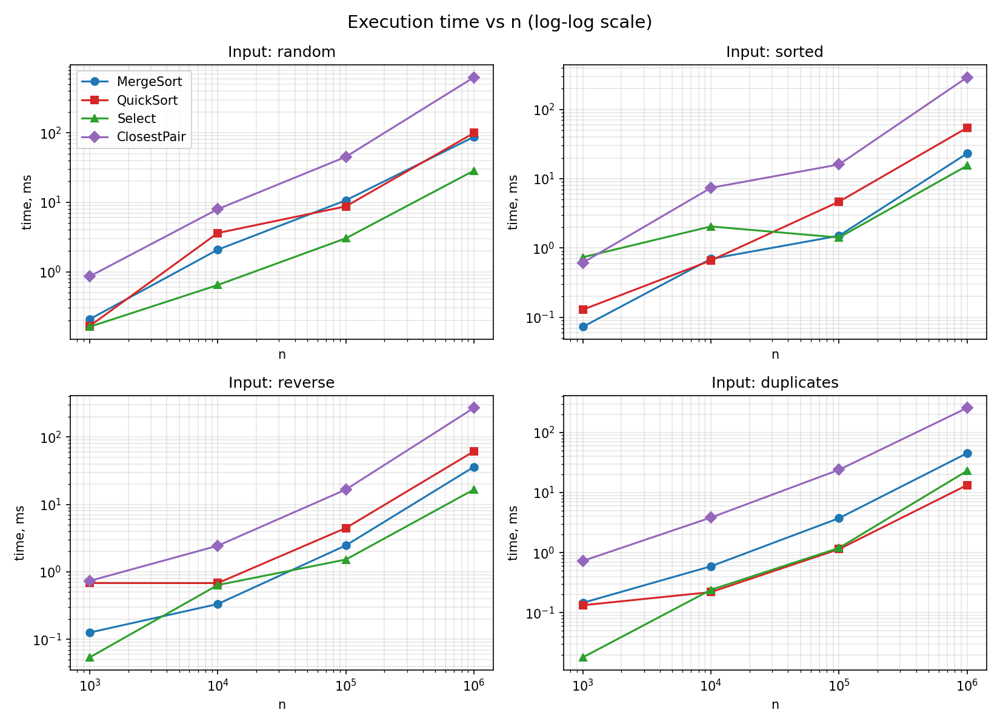
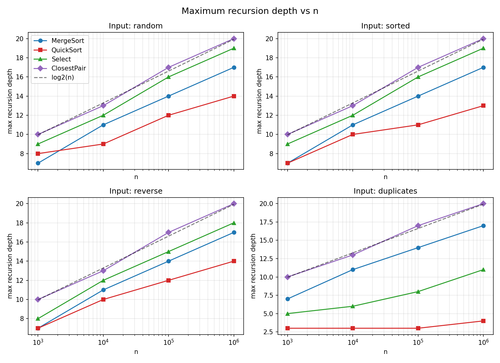
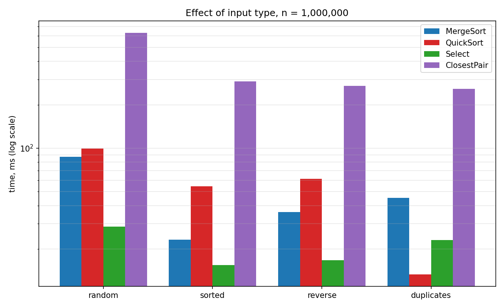
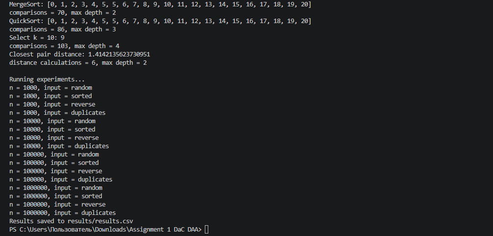
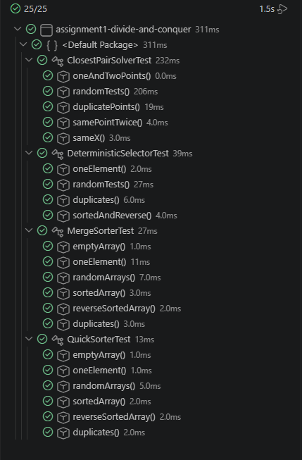
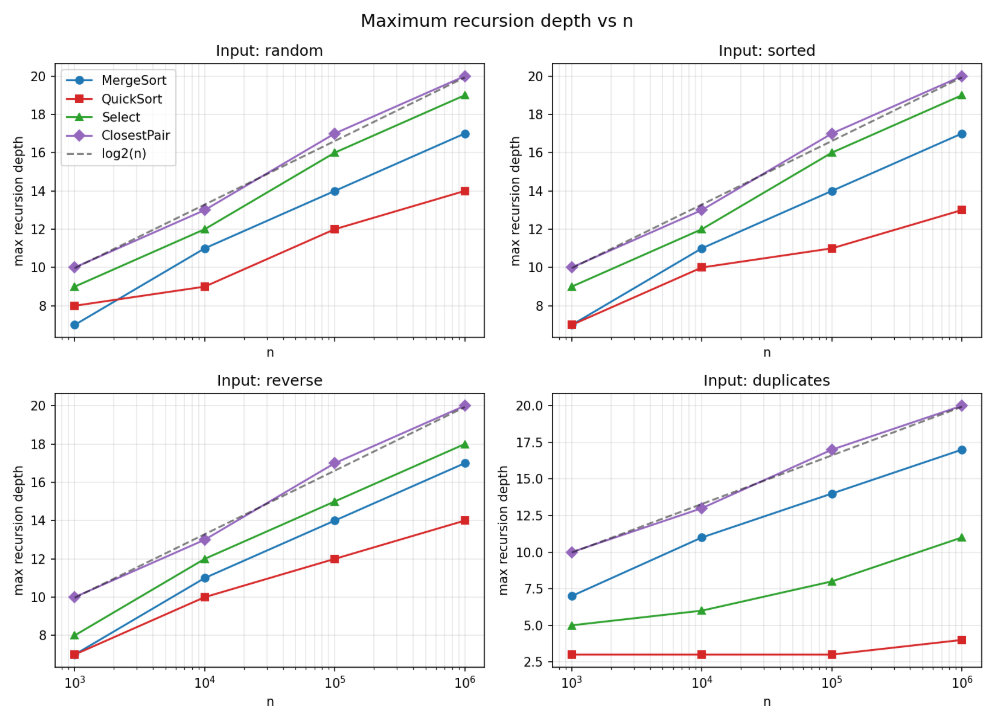
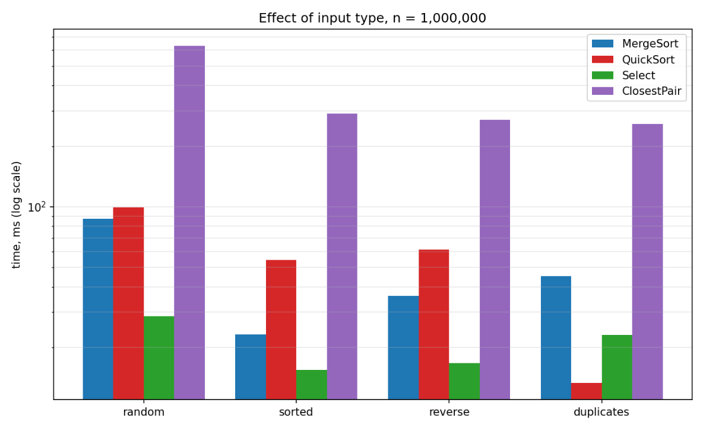
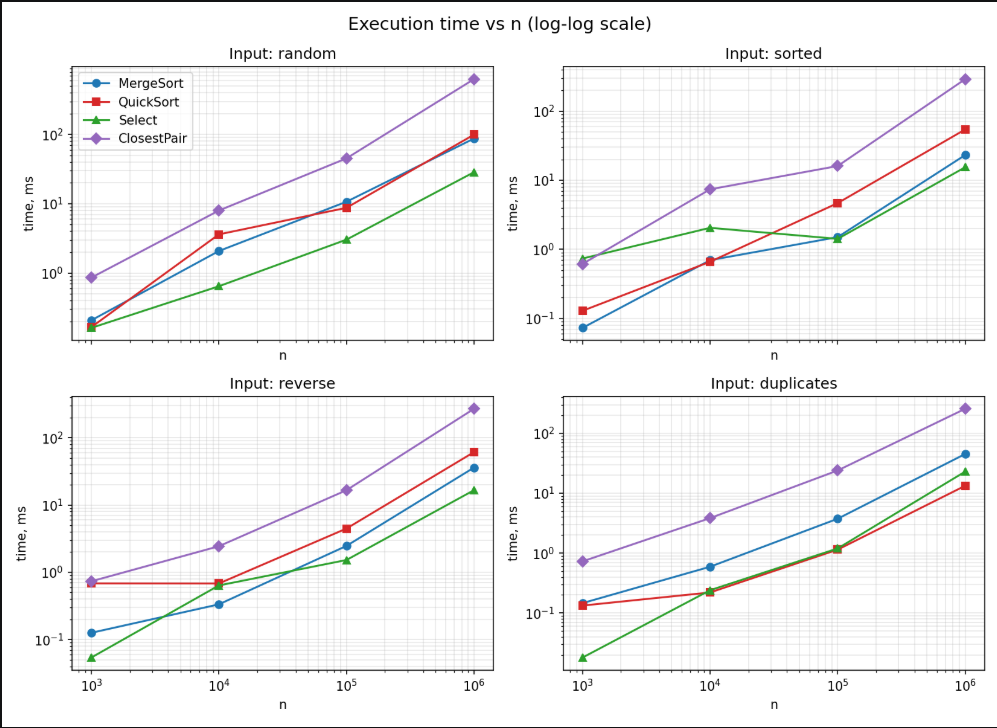

# Assignment 1: Divide-and-Conquer Algorithm Analysis

## A. Project Overview

### Purpose

The goal of this assignment is to implement classic divide-and-conquer algorithms in Java, analyze their running time with recurrences (Master Theorem and Akra–Bazzi intuition), measure them on different inputs, and compare the theory with the real results.

### Implemented algorithms

1. **MergeSort** – linear merge, one reusable buffer, insertion sort for small parts.
2. **QuickSort** – random pivot, in-place partitioning, recursion only into the smaller part.
3. **Deterministic Select (Median-of-Medians)** – groups of 5, in-place partitioning, recursion only into the needed part.
4. **Closest Pair of Points** – sort by x, divide and conquer, strip check in y-order.

### Project structure

```
assignment1-divide-and-conquer/
├── src/            MergeSorter, QuickSorter, DeterministicSelector,
│                   ClosestPairSolver, Point, Experiment, Main
├── tests/          JUnit 5 tests for all four algorithms
├── docs/
│   ├── plots/      time and depth plots
│   └── screenshots/
├── results/
│   └── results.csv
├── README.md
├── pom.xml
└── .gitignore
```

Every algorithm class has two public fields, `comparisons` and `maxDepth`, which are reset at the start of each call. For Closest Pair, `comparisons` counts distance calculations.

### How to run

Compile and run the program (PowerShell, from the project folder):

```
mkdir out
javac --release 8 -d out (Get-ChildItem src -Filter *.java).FullName
java -cp out Main
```

(On Linux/macOS: `javac --release 8 -d out src/*.java`.)

`Main` first shows a small demo of all four algorithms, then runs the experiments and writes `results/results.csv`.

Tests can be run with `mvn test` or with the Test Runner in VS Code. There are 25 tests and all of them pass:

- MergeSort and QuickSort are compared with `Arrays.sort()` on random, sorted, reverse-sorted, duplicate, empty and single-element arrays.
- Deterministic Select is checked with 200 random tests (plus duplicates, sorted and reverse arrays) against `Arrays.sort(a)[k]`.
- Closest Pair is compared with an O(n²) brute force for n ≤ 2000 (random points, duplicate points, points with the same x, one and two points).

## B. Algorithm Analysis

### 1. MergeSort

**How it works.** The array is split in two halves, each half is sorted recursively, and then the halves are merged. For the merge, the range is copied to one auxiliary buffer (created once per `sort` call and reused everywhere) and then merged back into the array. Parts of size 16 or less are sorted with insertion sort.

**Complexity.** Time Θ(n log n) in all cases. Extra space Θ(n) for the buffer plus O(log n) for the recursion stack.

**Recurrence.** T(n) = 2T(n/2) + Θ(n). Here a = 2, b = 2, so n^(log_b a) = n, which is the same order as f(n) = Θ(n). This is case 2 of the Master Theorem, so T(n) = Θ(n log n).

### 2. QuickSort

**How it works.** A random element is chosen as the pivot. The range is partitioned in place into three parts: smaller than the pivot, equal to the pivot, and bigger than the pivot. Then the algorithm calls itself only for the smaller of the two outer parts, and the bigger part is handled by the `while` loop (no new recursive call). The three-part partition is used so that arrays with many equal elements are not slow.

**Complexity.** Expected time Θ(n log n), worst case O(n²) (very unlikely with a random pivot). Extra space O(log n), because the recursion always goes into the smaller part.

**Recurrence.** With a good split, T(n) = 2T(n/2) + Θ(n), which is Θ(n log n) by the Master Theorem (case 2). In the worst case the pivot is the minimum or maximum every time: T(n) = T(n−1) + Θ(n) = Θ(n²). With a random pivot the expected number of comparisons is about 2n ln n ≈ 1.39 n log₂n, so the expected time is Θ(n log n).

### 3. Deterministic Select (Median-of-Medians)

**How it works.** To find the k-th smallest element:
1. Split the range into groups of 5 and sort each group with insertion sort.
2. Move the median of every group to the beginning of the range.
3. Find the median of these medians with a recursive call. This value is the pivot.
4. Partition the range in place around the pivot (smaller / equal / bigger).
5. Go only into the part that contains position k (or return the pivot if k is in the equal part).

**Complexity.** Worst-case time Θ(n). Extra space O(log n) for the recursion (the algorithm works in place, but it changes the input array).

**Recurrence.** The pivot has at least about 3n/10 elements on each side, so the recursive call for the answer is on at most 7n/10 elements:

T(n) ≤ T(n/5) + T(7n/10) + Θ(n)

Akra–Bazzi intuition: the fractions of the two recursive calls add up to 1/5 + 7/10 = 9/10 < 1. Because the total is less than 1, the work per level shrinks like a geometric series and the top-level Θ(n) work dominates, so T(n) = Θ(n). (The Master Theorem does not fit here because the two subproblems have different sizes.)

### 4. Closest Pair of Points

**How it works.**
1. Sort the points by x-coordinate (once).
2. Split the points in two halves by the middle x, solve both halves recursively, and let d be the smaller of the two answers.
3. Merge the two halves by y-coordinate (the same merge as in MergeSort, with one reusable buffer).
4. Build the strip: the points whose x is closer than d to the middle line. They are already in y-order.
5. For each point of the strip, compare it only with the next points while the y difference is smaller than d. There are only a few such points (at most 7), so this step is linear.
6. Parts with 3 points or less are solved by checking all pairs.

**Complexity.** Time Θ(n log n). Extra space Θ(n) (merge buffer and strip array) plus O(log n) for the recursion.

**Recurrence.** T(n) = 2T(n/2) + Θ(n) (the merge and the strip check are linear), so T(n) = Θ(n log n) by the Master Theorem (case 2). The first sort by x adds one more Θ(n log n), which does not change the result. Merging by y (instead of sorting the strip again on every level) is important: sorting the strip each time would give Θ(n log² n).

## C. Experimental Results

### Setup

- Environment: Windows, Java HotSpot 64-Bit Server VM 1.8.0_421.
- CPU / RAM: `<fill in>`
- Input sizes: n = 1,000; 10,000; 100,000; 1,000,000.
- Input types: **random**, **sorted**, **reverse**-sorted, **duplicates** (values from 0 to 9). For Closest Pair the points are generated in the same way: random points; x increasing / decreasing with random y; and points with both coordinates from 0 to 9.
- Deterministic Select looks for the median (k = n/2).
- For every configuration: one warm-up run (not measured), then 5 measured runs with `System.nanoTime()`. The table shows the average time of one run. The copy of the input array is made before the timer starts.
- `maxDepth` and `comparisons` are taken from the last run. QuickSort uses a random pivot, so its numbers change a little from run to run.
- All raw data is in `results/results.csv`.

### Execution time (ms, average of 5 runs)

| Algorithm | Input | n = 1,000 | n = 10,000 | n = 100,000 | n = 1,000,000 |
|---|---|---|---|---|---|
| MergeSort | random | 0.207 | 2.075 | 10.677 | 87.406 |
| MergeSort | sorted | 0.073 | 0.697 | 1.503 | 23.171 |
| MergeSort | reverse | 0.126 | 0.334 | 2.471 | 36.144 |
| MergeSort | duplicates | 0.146 | 0.592 | 3.749 | 45.277 |
| QuickSort | random | 0.165 | 3.607 | 8.731 | 99.508 |
| QuickSort | sorted | 0.129 | 0.661 | 4.668 | 54.319 |
| QuickSort | reverse | 0.684 | 0.682 | 4.477 | 61.418 |
| QuickSort | duplicates | 0.133 | 0.22 | 1.143 | 13.35 |
| Select | random | 0.161 | 0.643 | 3.029 | 28.554 |
| Select | sorted | 0.736 | 2.048 | 1.417 | 15.429 |
| Select | reverse | 0.054 | 0.638 | 1.525 | 16.667 |
| Select | duplicates | 0.018 | 0.24 | 1.196 | 23.009 |
| ClosestPair | random | 0.856 | 7.968 | 45.153 | 629.991 |
| ClosestPair | sorted | 0.615 | 7.388 | 16.047 | 290.433 |
| ClosestPair | reverse | 0.735 | 2.443 | 16.633 | 270.55 |
| ClosestPair | duplicates | 0.727 | 3.84 | 23.983 | 257.421 |

### Maximum recursion depth

| Algorithm | Input | n = 1,000 | n = 10,000 | n = 100,000 | n = 1,000,000 |
|---|---|---|---|---|---|
| MergeSort | random | 7 | 11 | 14 | 17 |
| MergeSort | sorted | 7 | 11 | 14 | 17 |
| MergeSort | reverse | 7 | 11 | 14 | 17 |
| MergeSort | duplicates | 7 | 11 | 14 | 17 |
| QuickSort | random | 8 | 9 | 12 | 14 |
| QuickSort | sorted | 7 | 10 | 11 | 13 |
| QuickSort | reverse | 7 | 10 | 12 | 14 |
| QuickSort | duplicates | 3 | 3 | 3 | 4 |
| Select | random | 9 | 12 | 16 | 19 |
| Select | sorted | 9 | 12 | 16 | 19 |
| Select | reverse | 8 | 12 | 15 | 18 |
| Select | duplicates | 5 | 6 | 8 | 11 |
| ClosestPair | random | 10 | 13 | 17 | 20 |
| ClosestPair | sorted | 10 | 13 | 17 | 20 |
| ClosestPair | reverse | 10 | 13 | 17 | 20 |
| ClosestPair | duplicates | 10 | 13 | 17 | 20 |

### Comparisons (Closest Pair: distance calculations)

| Algorithm | Input | n = 1,000 | n = 10,000 | n = 100,000 | n = 1,000,000 |
|---|---|---|---|---|---|
| MergeSort | random | 10,373 | 127,254 | 1,640,365 | 20,227,535 |
| MergeSort | sorted | 3,956 | 59,248 | 744,016 | 8,952,320 |
| MergeSort | reverse | 10,300 | 93,648 | 1,208,816 | 15,117,824 |
| MergeSort | duplicates | 9,771 | 121,695 | 1,561,529 | 19,206,933 |
| QuickSort | random | 11,955 | 153,150 | 2,019,564 | 24,976,764 |
| QuickSort | sorted | 11,014 | 156,634 | 2,207,663 | 25,325,830 |
| QuickSort | reverse | 10,828 | 158,823 | 2,053,813 | 24,992,479 |
| QuickSort | duplicates | 3,050 | 36,051 | 320,268 | 3,199,809 |
| Select | random | 7,781 | 81,136 | 847,800 | 8,359,448 |
| Select | sorted | 6,238 | 68,030 | 709,499 | 7,217,916 |
| Select | reverse | 7,347 | 78,172 | 798,554 | 8,099,863 |
| Select | duplicates | 3,074 | 30,929 | 310,140 | 5,736,095 |
| ClosestPair | random | 1,105 | 12,998 | 142,647 | 1,219,004 |
| ClosestPair | sorted | 1,205 | 13,289 | 143,483 | 1,218,576 |
| ClosestPair | reverse | 1,212 | 13,291 | 143,722 | 1,218,739 |
| ClosestPair | duplicates | 727 | 8,895 | 104,842 | 757,104 |

### Plots







### Summary of the results

- MergeSort makes almost exactly n·log₂n comparisons on random data (the ratio to n·log₂n is between 0.96 and 1.04 for all sizes). QuickSort makes about 1.2·n·log₂n comparisons.
- The number of comparisons of Select per element stays almost constant (7.8 for n = 1,000 and 8.4 for n = 1,000,000), so Select is linear.
- Closest Pair makes only about 1.1–1.4 distance calculations per point; its time grows like n log n because of the sort and the merge steps.
- The recursion depth of all algorithms grows like log₂n (see the dashed line on the depth plot). QuickSort has the smallest depth (14 for n = 1,000,000 random).
- For n = 1,000,000, Select (28.6 ms) is about 3 times faster than the sorts (87.4 ms for MergeSort and 99.5 ms for QuickSort) on random data.

## D. Discussion

### Do the results match the theoretical complexity?

Yes. When n grows 10 times, the time of Select grows about 4–9 times (linear), the time of MergeSort and QuickSort about 8–11 times, and the time of Closest Pair about 9–14 times, which is close to n log n (from 100,000 to 1,000,000 the ideal n log n growth is about 12 times). The comparison counters follow the theory even better than the times: MergeSort ≈ n·log₂n, QuickSort ≈ 1.2·n·log₂n, Select ≈ 8n. The times are less clean because of JVM effects (see below); for n = 1,000 the times are below 1 ms and are mostly noise. For example, Select on sorted input took 0.736 ms and on reverse input 0.054 ms, although the work is almost the same.

### How does input structure affect performance?

- **MergeSort** is about 3.8 times faster on sorted data (23.2 ms vs 87.4 ms for n = 1,000,000) and makes less than half of the comparisons (8.9 million vs 20.2 million), because in the merge the left part is always taken first and the branch is easy to predict. Duplicates do not help it.
- **QuickSort** does not have a bad case on sorted or reverse data, because the pivot is random: it is even faster there (54 ms and 61 ms vs 99.5 ms on random). On duplicate-heavy data it is the fastest (13.4 ms) because of the three-part partition; its depth is only 3–4.
- **Select** is a bit faster on sorted and reverse data (15–17 ms vs 28.6 ms) and on duplicates it needs a much smaller recursion depth (11 vs 19).
- **Closest Pair** is about 2 times faster on sorted x (290 ms vs 630 ms), because `Arrays.sort` is very fast on already sorted data and the memory access is more regular.

### Why does smaller-first recursion help QuickSort?

If the algorithm recurses into the smaller part and loops over the bigger part, the size of the range in every recursive call is at most half of the previous one. So the recursion depth is at most log₂n even when the pivots are bad. If we recursed into the bigger part, a series of bad pivots could make the depth O(n) and cause a stack overflow for large arrays. This does not change the running time, but it keeps the stack space at O(log n). In our results the depth for n = 1,000,000 is only 13–14 (4 for duplicates), while log₂(1,000,000) ≈ 20.

### Why does Median-of-Medians guarantee O(n)?

The median of the group medians is bigger than at least half of the medians, and each of those groups has 3 elements that are not bigger than it. So at least about 3n/10 elements are smaller than or equal to the pivot, and in the same way at least 3n/10 are bigger or equal. That means the recursive call for the answer works on at most 7n/10 elements. The recurrence is

T(n) ≤ T(n/5) + T(7n/10) + c·n.

If we guess T(m) ≤ a·m for smaller m, then T(n) ≤ (a/5 + 7a/10 + c)·n = (9a/10 + c)·n, and this is at most a·n when a ≥ 10c. So T(n) = O(n). The main point is that 1/5 + 7/10 < 1: the sizes of the two recursive calls together are smaller than n, so the work shrinks on each level. The measured number of comparisons per element (about 8) is constant, as expected.

### Why is divide-and-conquer Closest Pair faster than O(n²) for large inputs?

The brute-force solution checks all n(n−1)/2 pairs; for n = 1,000,000 this is about 5·10¹¹ pairs. The divide-and-conquer solution only checks pairs inside the small parts and pairs in the strip, and every point of the strip is compared with a constant number of neighbours in y-order, so the merge step costs only Θ(n). In total this is T(n) = 2T(n/2) + Θ(n) = Θ(n log n). In our experiment, for 1,000,000 random points the algorithm calculated only about 1.2 million distances.

### What practical factors affect performance?

- **JVM and JIT:** the first runs are slow because the code is interpreted before the JIT compiles it. That is why every configuration has a warm-up run. Small inputs are still noisy.
- **Garbage collection:** MergeSort and Closest Pair allocate buffers, and Closest Pair works with a million `Point` objects, so GC pauses can appear in the measurements.
- **Cache and memory layout:** an `int[]` is stored in one block of memory, but an array of `Point` objects is an array of references to objects that can be far from each other. This gives many cache misses and is one reason why Closest Pair is much slower than the sorts, even with fewer operations.
- **Branch prediction:** sorted input makes the merge and partition branches predictable, so the same algorithm runs faster.
- **Timer and system noise:** `System.nanoTime()` is precise, but other programs, CPU frequency changes and the OS scheduler add noise, especially for measurements below 1 ms.

## E. Reflection

In this assignment I learned how to move from a recurrence to a real program and back. It was interesting to see that the theory works well for the operation counters (n log n for the sorts, a constant number of comparisons per element for Select), while the real time depends a lot on the input and on the JVM and memory. I also learned why details like the smaller-first recursion in QuickSort and the three-part partition matter: they do not change the big-O for random data, but they protect the algorithm from deep recursion and from slow work on duplicates.

The main implementation challenges were the details of the algorithms and of the setup. In Median-of-Medians it was easy to make mistakes with the indexes, because the medians are moved to the beginning of the same range and the recursive call works on that range. In Closest Pair I had to merge the points by y inside the recursion, because sorting the strip on every level would make the algorithm slower than Θ(n log n). I also had to learn the tools: creating the Git repository and making commits step by step, and setting up Java (a JDK is needed for compiling, not only a JRE) and JUnit tests in a Maven project.

## F. Screenshots

**Program output**



**Test results (25/25 tests passed)**



**Plots and results**







